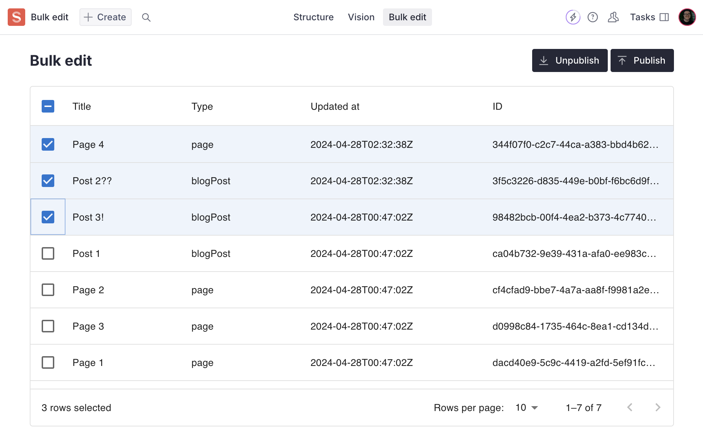

# Sanity Bulk Edit example

An example of using [@mui/x-data-grid](https://mui.com/x/react-data-grid/) to manage content in Sanity.

## Usage

The contents of `/bulk-edit` can be copied into your project, then just add the exported tool to your Sanity config:

```typescript
import {defineConfig} from 'sanity'
import {bulkEdit} from './bulk-edit'

export default defineConfig({
  // ...rest of your config file
  tools: [bulkEdit()],
})
```

And install the needed dependencies

```bash
npm install @mui/x-data-grid @mui/material @emotion/react @emotion/styled
```

Check out the [@mui/x-data-grid installation guide](https://mui.com/x/react-data-grid/getting-started/#installation) for more info

## Example usage


